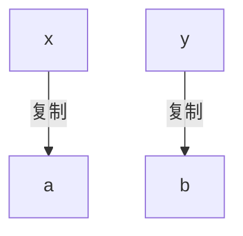
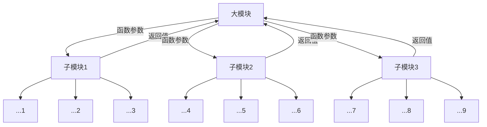

# 信手相连
---
这里是lwy信手相连活动的仓库:smile:

video文件夹存储上课录屏的百度云盘(因为github单个文件不能太大)

如果可以的话之后大家可以把资料啥的都聚一聚

<!-- TOC -->

- [信手相连](#信手相连)
  - [course1](#course1)
  - [course2](#course2)
    - [debug](#debug)
    - [数组](#数组)
    - [枚举](#枚举)
    - [例题](#例题)
  - [course3](#course3)
    - [review](#review)
    - [结构体](#结构体)
    - [排序](#排序)
    - [结构体+排序](#结构体排序)
    - [代码结构(当然写之前肯定得有解题思路)](#代码结构当然写之前肯定得有解题思路)
    - [例题](#例题-1)
  - [course4](#course4)
    - [读入问题](#读入问题)
    - [分类讨论](#分类讨论)
    - [结构体作为返回值](#结构体作为返回值)
    - [最大回文子串](#最大回文子串)
    - [筛法求质数](#筛法求质数)
    - [数位分离和进制转换](#数位分离和进制转换)
    - [字符串复习练习题](#字符串复习练习题)
  - [course5](#course5)
    - [函数](#函数)
      - [概述](#概述)
      - [函数参数](#函数参数)
      - [理解](#理解)
      - [Remeber](#remeber)
    - [指针](#指针)
    - [递归](#递归)
      - [汉诺塔](#汉诺塔)
      - [全排列](#全排列)
      - [143 数列合并](#143-数列合并)
  - [course 6](#course-6)
    - [写递归代码的关键](#写递归代码的关键)
    - [经典架构](#经典架构)
    - [递归的本质](#递归的本质)
    - [递归的关键](#递归的关键)
    - [124 滑雪](#124-滑雪)
      - [v\_1 收束型](#v_1-收束型)
      - [v\_2 探索型，可以理解为dfs(深度优先搜索)](#v_2-探索型可以理解为dfs深度优先搜索)
    - [组合数](#组合数)
      - [题目描述](#题目描述)
      - [输入描述:](#输入描述)
      - [输出描述:](#输出描述)
      - [输入](#输入)
      - [输出](#输出)

<!-- /TOC -->

## course1
**wiki资源**

oi-wiki: https://oi-wiki.org/

cs-wiki: https://csdiy.wiki/CS%E5%AD%A6%E4%B9%A0%E8%A7%84%E5%88%92/

**刷题网站**

洛谷: https://www.luogu.com.cn/

codeforces: https://www.luogu.com.cn/

vjudge: https://vjudge.net/

力扣leetcode: https://leetcode-cn.com/

牛客网: https://www.nowcoder.com/

**语言基础**

菜鸟教程: https://www.runoob.com/

**算法、数据结构可视化**

https://www.cs.usfca.edu/~galles/visualization/Algorithms.html

## course2
### debug
相信大家应该都配置好了debug环境。上次断点跳转的原因是我打断点的地方是声明语句，而声明语句除非是你写错了报语法错误；否则声明语句不可能在运行的时候出问题，因此调试程序不允许也不用你在那打断点，而是会自动跳到可以断点的位置。
### 数组
最开始是用来存储的(比如让你们顺序读入一堆数，然后逆序输出)
数组的妙用：
https://blog.csdn.net/lanchunhui/article/details/51518131
比如数组可以做计数器
以存代算的记录思想
### 枚举
**循环不等于枚举**

同一段逻辑可以由不同的代码写出来，刷题少时可能感觉自己的代码麻烦，这个时候就可以去和别人交流从而获得更好的思路。

枚举就是列举(for)解空间中所有的结果，并挨个进行尝试(for内部)，最终筛选(if-else)出符合条件的我们想要的结果。所以对于一些简单的题，我们只要关注最后输出是什么，即我们想要什么，就可以知道应该枚举什么，但是对于有些题，枚举可能是中间过程，从枚举结果到最终输出还有一段距离。

我的建议：枚举前加注释说明这段枚举是在干什么，枚举中的ifelse注释分别是哪些条件。因为你很有可能写着写着忘了内部循环该怎么写。

先分析得出总体思路 自顶向下或自底向上，建议思路从上到下(想好大概需要哪些东西，哪些需要优化，多个部分如何链接)、写的时候从下到上(一个一个搭积木搭建起来，搭一点测一点，多printf，甚至你可以设一个#define PRINT和#ifdef)
其中包括读入思路
然后写读入，并**测试**读入是否正确
不会的函数就去查，记得多了就好了，比如我就不记得求字符串长度的strlen了
我也出问题，比如""和''不分，仔细查看报错原因，不懂就查。
然后适当改写程序结构，使其美观，减少运算量
最后加特判，比如是不是首位为X
long long
一些经典的架构
```c++
while(1)
{
    if(...)
    {
        break;
    }
}
```
```c++
int flag=0;
for()
{
    if(...)
    {
        flag=1;
    }
}
if(flag==1)
{
    output=...
}
else
{
    output=...
}
```

### 例题
难度递增顺序：
182
643
134


## course3
### review
原来大家还没有讲到函数，上次那个strlen和atoi其实可以替换成自己的代码比如：
```cpp
// strlen
int len = 0;//已经到达的长度
for(len=0;s[len]!='\0';len++)
{
    //当取到的值是\0说明字符串结束了
}
//这里的len就是字符串长度了
```

### 结构体
结构体有什么用？

结构体能够把一个东西的**多个属性放在一起**，形成一个**整体**，相当于自己定义了一个**新的数据类型**。(比如一个学生，有学号、成绩之类的)

所以当你需要很多的东西时，怎么办？开个结构体数组，不就是一堆学生了。因为数组最开始的定义就是相同数据有很多个。

还有什么呢，还有结构体里面嵌结构体，就是信息的进一步聚合。
```cpp
struct Point
{
    int x,y;//横纵坐标
};
struct Triangle
{
    Point vertexs[3];//三角形的三个顶点
}
```

### 排序
排序是什么？

排序是按照**我们定义的比较规则**，将一些无关的数据挨个摆着。(大佬看这里:现在只讲基于比较的排序，上限O(nlogn)，还有不基于比较的，你们自己去查)

比如一般意义的<，这个规则说明了1比2小，2比3小。

再比如我现在有三个玩具：🐢、🚒、🎂，我现在就是要求消防车最大，乌龟次之，蛋糕最小。那么给你一串这样的玩具，你会把它排号，这里的**比较规则**就是我们定义的了。

**排序算法**则是大家已经发现的，能够完成这一任务的方法，当然大家的水平不一样，所以有的快有的慢，甚至有的人排不对。比如上面这个，最简单的思路就是我一个一个去看，找到消防车就往前面放，找到就放，没有了再找乌龟。(当然这个很慢很慢)

先掌握冒泡和选择排序，当然所有排序在目的上都是等价的，只是时间的问题。之后会教快排，插个眼：一定一定一定要自己能直接敲出快排的代码，不要问为什么。

### 结构体+排序
结构体给了你高度的**数据自由**，排序给了你决定**比较规则的自由**，所以能结合的很好。(也能出很多题)

Notes:
对结构体排序时，往往只有一部分数据是作为比较使用的，其他一部分是牵连、顺带着走的，例如没办法题目要求输出的玩意

### 代码结构(当然写之前肯定得有解题思路)
1. 全体初始化
2. 读取**提示信息**(提示你接下来读多少个的数，这个数往往只会用在for循环的循环次数控制里面，用完就丢了)和**数据信息**(有实际意义的，需要保留下来的数据)
3. 将读取到的原有数据进行一定的处理，产生方便后续使用的其他信息
4. 排序(关键在于定义比较规则)
5. 输出

### 例题
90 486


## course4 
### 读入问题
1. 有若干组字符串，最后以"END"结尾，表示读入结束(数字的话一般是0,-1等)
```cpp
char s[20];
while(1)
{
    //先读
    scanf("%s",s);
    //然后比较是不是END，如果是就退出
    if(strcmp(s,"END")==0)break;
    //否则就做该做的
    ...
}
```
2. 接下来一行是一个数字n，表示后面有n个字符串
```cpp
//其实就是上节课说的提示信息
int n;
char s[20];
scanf("%d",&n);
for(int i=0;i<n;i++)
{
    scanf("%s",s);
    ...
}
```
3. (啥也没说,不知道读多少行，这种情况一般是在文件读入的时候，因为终端读入会等待你输入，而文件其实隐藏了末尾的结束标记)
```cpp
// 因为scanf的返回值是读入成功的个数
char s[20];
while(scanf("%s",s)!=0)
{
    ...
}
```

### 分类讨论
当有时候题目太复杂或者情况很多时，不妨假设一些值，做出来之后再把这些值写成一个变的值。

### 结构体作为返回值
因为return 只能返回一个值，当你想返回多个值时，可以把返回值单独当作一个结构体
```cpp
struct ReturnValue
{
    int pos;//position
    int value;//value
};
```

### 最大回文子串
给定一个字符串s，求s的最大回文子串，例如abbcba，则输出bb

记住 串!=序列

空隙插入特殊字符#

	#a#b#b#c#b#a#b#a

这样就可以只用考虑奇数回文串
```cpp
#include<bits/stdc++.h>
using namespace std;
const int N=1e3+10;
int dp[N][N];
int main()
{
    string str;
    getline(cin,str);
    int res=0;
    for(int i=0;i<str.length();i++)
    {
        int l=i-1,r=i+1;//判断奇数长度回文串
        while(l>=0&&r<str.length()&&str[l]==str[r]) l--,r++;
        res=max(res,r-l-1);
        l=i,r=i+1;//判断偶数长度回文串
        while(l>=0&&r<str.length()&&str[l]==str[r]) l--,r++;
        res=max(res,r-l-1);
    }
    cout<<res<<endl;
    return 0;
}
```
拓展：DP，二分+hash，Manacher算法

### 筛法求质数


```cpp
// 朴素筛求质数，时间复杂度：O(n*log(n))
void get_primes(int n) {
    for (int i = 2; i <= n; i++) {
        if (!st[i]) primes[cnt++] = i;
        for (int j = i + i; j <= n; j += i) st[j] = true;
    }
}
```
拓展：挨拉托色尼筛，欧拉筛

### 数位分离和进制转换
```cpp
#include <stdio.h>

int main()
{

	int a, x;

	/* 数位分离 */
	// 主要利用整除和取余两种运算来获取某一位上的数

	/* 获取个位 */
	x = a % 10;
	/* 获取十位 */
	x = (a / 10) % 10; // 对十整除之后，十位就变到了原来个位的位置上，通过这样两种运算就可以获得任意数位的数
	/* 获取第k位（从个位数起） */
	x = a;
	for (int i = 1; i <= k - 1; i++)
		x /= 10; // 除去10^(k-1)，多次查询的时候可以把它预先存到数组里，之后查表即可
	x %= 10;
	/* 获取第 p-q 位之间的数 */
	int pow_10[];						 // 存放10的幂
	// 123456
	// q   p
	x = (a / pow_10[p - 1]) % pow_10[q]; // 先把p位之后的数抹掉，再把q位之前的数抹掉

	// 同理，对于p进制的数也一样处理，只需要把10换成p就可以了，即
	x = a % p;
	/* 特别地，由于在系统中数字是通过二进制存储的，我们可以利用“位运算”的方法方便的取出二进制中的某一位，在这里不详细展开。 */
	x = (a & (1 << k - 1)); // 获取二进制下a的第k位
	// 111001101010
	// 100101010010
	/* 进制转换 */
	// 用10进制作为中介可以完成任意m到n进制的转换

	int a_n, a_10;
	/* n进制转化为10进制 */
	int x = 1; // 表示现在末尾的1代表的是n的多少次方
	while (a_n > 0)
	{
		a_10 += (a_n % 10) * x; // 取出当前数的个位，乘上它实际代表的大小
		a_n /= 10;				// 继续考虑下一位
		x *= n;					// 更新为现在的末尾代表的n的次方
	}							// 这个数的最高位转化完了之后，变成了0，转化完成

	/* 10进制转化为m进制 */
	// 由于int类型默认十进制，因此我们用数组来存m进制下的每一位
	int a[];
	for (int i = 0; a_10 > 0; i++)
	{
		a[i] = a_10 % m; // 取出当前最末位
		a_10 /= m;		 // 删掉当前位
	}

	return 0;
}
```
关键点就在于"%"是提取后面几位，"/"就是去除最后几位。易错点就是**是否对原数做了修改**。

### 字符串复习练习题
可以找洛谷的字符串专题，比如

https://www.luogu.com.cn/problem/P1957 

https://www.luogu.com.cn/problem/P1125

## course5

### 函数

#### 概述

函数在程序中总共只有三种情况：**声明、实现、调用**；分别是如下格式：

```cpp
//声明
int max(int num1, int num2);

//实现
int max(int num1,int num2)
{
    ...
    //int res=max(num1-1,num2-1);
    return num1>num2?num1:num2;
}

//调用
int main()
{
    int a,b;
    scanf("%d %d",&a,&b);
    int maxn = max(b,a);
    printf("%d",maxn);
}
```

**现阶段不写多文件的时候大家可以不写声明只写实现，但是实现必须写在任何一个调用它的位置的前面**

如果有声明的话，声明写在调用前的话，那么实现可以写在任何一个声明之后的位置而与调用的位置无关。

由C语法定义，**不允许在函数里再声明一个函数，但是允许函数里调另一个函数，甚至允许在一个函数实现的时候就在里面调用自己。**（这就是递归)

#### 函数参数

如果不用 **引用类型** 那么都是**传值!!!(即使是指针其实也是copy了一份指针)**(传值就是copy的意思)

函数声明与实现部分的那个参数是形参，只要保证函数实现里面用这个参数是正确的即可；同样的道理，调用函数时，只用保证传进去的值的类型是匹配的即可。

#### 理解

函数其实就是**一段代码**，main也是一个函数，所以main里面也是一段代码。

只是由于你写的一大坨代码实在是太丑，所以把你的代码都分开放了，显得能看一点，当然也方便功能复用。

那么为了完成代码段之间的转换，所以要给调用者和被调用者之间留一个**通信**机制，所以函数的**入口是参数，出口是返回值。**当然因此，你某一方不需要传递信息的时候，就出现了参数为空，以及return类型为void的情况。

**位置与类型都匹配时函数即可成功调用**

当你完成一个函数之后那么你就要用封装的视野去看它，即：**函数就是完成某一功能的，我只要调它就行了。**

#### Remeber

```cpp
void swap(int a,int b)
{
	int tmp=a;
	a=b;
	b=tmp;
	return;//当然这句不写也行
}
int main()
{
    ...
        int x,y;
    ...
       swap(x,y);//这里完成不了对应功能
}
```

**这是不对的!!!**

因为是复制过来的，所以a和b只是有那个值，在函数里面也确实交换了a,b，但是这个a,b不是你调用者的两个值。



可以用指针或者引用实现，但是如果不会就先别写，先按原来的搞法在main里面用temp交换

### 指针

这里先把变量分别叫做**普通变量和指针变量**

变量也是有**声明和使用两个概念!!!**

声明指针：在正常的数据类型后面加一个*即可

使用指针：正常变量使用&即可**取到地址，也就是一个指针**，指针变量使用*可以访问指针变量所指向的值，所以这两个实际是一个逆过程。

如果你没有了解过具体的堆栈概念或者不是scanf这种别人要求你用的，那么请**不要对轻易对局部变量用取地址符**，要用的就声明指针。

指针也是一个类型，这个类型也会占空间，指针也是一串数据，比如0x7fff，只是这个指针指向的是对应东西。

```cpp
int *p;
printf("%d",*p);
int n;
scanf("%d",&n);
void scanf(const char* s,int* p)
{
    *p = 终端读入的值
}
```


### 递归

#### 汉诺塔

**给定一个整数n，代表汉诺塔游戏中从小到大放置的n个圆盘，假设开始时所有的圆盘都在左边的柱子上，按照汉诺塔游戏的要求把所有的圆盘都移动到右边的柱子上，实现函数打印最优移动轨迹。**

[图片示意](https://cn.bing.com/search?q=汉诺塔图片&qs=SC&pq=汉诺塔tup&sc=7-6&cvid=BB74C6E8987D4424AAD04DC39272028E&FORM=QBRE&sp=1)

```cpp
#include<stdio.h>
//hanoi
/*
	函数功能:
	把n个圆盘从a柱移动到c柱，中间借助b柱
	这里的a,b,c就像高中的x,y,z一样，只是一个符号记号
	所以实际指的是会完成从第一个char到第三个char的移动，调用者完全可以自己用其他字符
*/
void hanoi(int n, char a, char b, char c)
{
    if(n == 1)
    {
        printf("%c->%c\n", a, c);
    }
    else
    {
        hanoi(n-1, a, c, b);
        printf("%c->%c\n", a, c);
        hanoi(n-1, b, a, c);
    }
}
int main()
{
    int n;
    scanf("%d", &n);
    hanoi(n, 'A', 'B', 'C');
    return 0;
}
```


#### 全排列

**首先注意一点，数组其实也是个指针，所以你函数传的参数如果是数组的话不用担心数据拷贝太多而导致MLE，而是担心数组中的值在子函数中被修改。**

**一定要牢记哪些是修改的，哪些是不修改的！**

伪代码：

```cpp
const int MAXN=1005;
int a[MAXN];//1 2 3 4.. n
//完成m到n的全排序
Permutation(m,n){
if:全排列只有一个数，输出排列
  else: 
    //1 2 3 4
    //m=1,n=4
    for{i=m;i<=n;i++}{//i遍历第m~n个数，每次以a[i]所存的数值为打头的数
        swap(a[m],a[i]);//把要打头的数放到最开头的位置（即m所在的位置）
        Permutation(m+1,n);//递归，要相信它能完成m+1到n的排列，不要人脑压栈
        swap(a[m],a[i]);//为避免重复排序，每个数打头结束后都恢复初始排序
     }
}
```

cpp代码：

```cpp
void Permutation(int a[],int m,int n){
    if(m==n){
        cout<<a[0];
        for(int i=1;i<n;i++){
            cout<<" "<<a[i];
        }
        cout<<endl;
    }
    else {
        for(int i=m;i<n;i++){
            int temp=a[m];
            a[m]=a[i];
            a[i]=temp;
            Permutation(a,m+1,n);
            temp=a[m];
            a[m]=a[i];
            a[i]=temp;
        }
    }
}
```

其实相当于n层for循环的嵌套，由于这个n是由用户输入的，所以我们写代码时不知道有几层，所以只能采用递归的这种写法，本质上是利用了栈这种数据结构，所以如果有人说可以取消递归而全部用循环代替，那么他就必须要手动维护一个栈。

是不是长得很像**数学归纳法**，包括初始状态和递推关系。

#### 143 数列合并

([143.数列合并 题目详情 (ruc.edu.cn)](http://yoj.ruc.edu.cn/index.php/index/problem/detail/pno/143.html))

```cpp
#include <stdio.h>
#include <string.h>
int n, sum;
int flag = 0;
int a[20], b[20], used[10] = {0};
void getdata()
{
	scanf("%d%d", &n, &sum);
	return;
}
int getnum()
{
	int m = n;
	while (m--)
		for (int i = 0; i < m; i++)
		{
			b[i] = b[i + 1] + b[i];
		}
	return b[0];
}
void mycopy() //将a数组复制给b数组
{
	int i, j;
	for (i = 0; i < n; i++)
	{
		b[i] = a[i];
	}
}
//dep是递归深度，最开始是0
void dg(int dep)
{
	if (flag)
		return;
    //终止条件
	if (dep == n)
	{
        //判断这个排列是否满足条件
		mycopy();
		int m = getnum();
		if (m == sum)
		{
			for (int i = 0; i < n; i++)
			{
				printf("%d ", a[i]);
			}
			printf("\n");
			flag = 1;
			return;
		}
	}
	else
	{
		for (int i = 1; i <= n; i++)
		{
            // 1 2 3 4
            // 1 4 3 2
			if (used[i] == 0)
			{
				a[dep] = i;
				used[i] = 1;
				dg(dep + 1);//在这！
				used[i] = 0;//回退
			}
		}
	}
}
int main()
{
	getdata();
	dg(0);
}
```


## course 6

常用来传递的参数：**递归深度dep，数组的位置信息，选择不同递归路径的pattern**

常用的全局信息：vised(used)数组，不方便传参只好设成全局的data数组，flag标记，等等

总而言之，一句话：你只用负责**想好思路**，至于需要什么写法，都是后面可以再加的。比如说你递归写着写着发现需要记录一些信息，你就可以根据这个信息是全局的还是需要递归传下去的，来决定写在全局还是写在参数里面。总而言之之前所学的技巧都能用上来。

### 写递归代码的关键




### 经典架构

```cpp
return_type dg(...)
{
	//终止条件
	if(...)
    {
        //这往往输出或者记录一些结果，所以可能会写入一个全局变量等
    }
    else //递归关系
    {
        //这里可以写任意的你想好的递归关系
        //比如说循环等
        for(int i=1;i<=n;i++)
        {
            //递归前的预操作
            int tmp=a[i];
            a[i]=...;
            
            //递归进入子状态
            dg(...);
            
            //递归后的恢复
            a[i]=tmp;
            
		}
    }
}
```

当然有的是要先递归，等所有的递归都走完再判断，所以这里是有一个时间上的先后关系的，请按照上述树形图来理解真正应该写的位置！

### 递归的本质

**把原问题变成一个等待求解的这样的问题，即：能把这个问题分解成若干子问题，并且子问题与原问题是同一个问题，只是在解决问题的规模上逐渐变少，最后变的可以解决。**

### 递归的关键

**找到递归关系！！！**，即如果我能解决一个子问题，那么我能利用这个来解决现在的问题吗。

### 124 滑雪

思路：

首先要输出最长的线路，那么显然，这就是个求最大值的问题，非竞赛状态下，我们肯定只用遍历一遍就好了，也就是说，如果我能找到每一个点滑出去的最大长度，那么我就能够扫描一遍整个地图，从而知道最长的路线，所以问题转化成了如何求**任意一个点滑出去的最大长度**。

对于这个问题，我们是否能把它转化成子问题？其实，由于你在某一个点最多也只能向四周滑，所以如果我知道了我周围某一个点的最大长度，如果我能滑过去，那么这条线路的长度加1就是我能滑出的长度，那么我四周能滑且最大的那个就是我能滑出去的最大长度了。这个问题是一个子问题，而且与原问题属于同一性质的问题。

#### v_1 收束型

#### v_2 探索型，可以理解为dfs(深度优先搜索)

### 组合数

#### 题目描述                    

> 从 1~n 这 n 个整数中随机选出 m 个，输出所有可能的选择方案。$n \gt 0, 0 \leq m \leq n, n+(n-m)\leq 25$。

#### 输入描述:

> 两个整数n，m。

#### 输出描述:

> 按照从小到大的顺序输出所有方案，每行1个。首先，同一行内的数升序排列，相邻两个数用一个空格隔开。其次，对于两个不同的行，对应下标的数一一比较，字典序较小的排在前面（例如1 3 9 12排在1 3 10 11前面）                   

#### 输入

```
5 3
```

#### 输出

```
1 2 3
1 2 4
1 2 5
1 3 4
1 3 5
1 4 5
2 3 4
2 3 5
2 4 5
3 4 5
```
